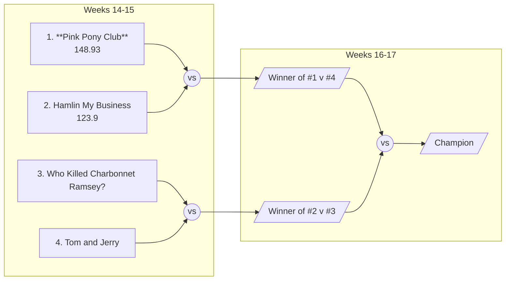

```mermaid
%%{init: {"flowchart": { "wrap": true }}}%%
flowchart LR
    subgraph Weeks 14-15
        T1["1. **Pink Pony Club** \n 148.93"]
        T2["2. Hamlin My Business \n 123.9"]
        T3["3. Who Killed Charbonnet Ramsey?"]
        T4["4. Tom and Jerry"]
        M1(("vs"))
        M2(("vs"))
        T1 --> M1
        T2 --> M1
        T3 --> M2
        T4 --> M2
    end
    subgraph Weeks 16-17
        W1[/"Winner of #1 v #4"/]
        W2[/"Winner of #2 v #3"/]
        M1 --> W1
        M2 --> W2
        CHAMP(("vs"))
        W1 --> CHAMP
        W2 --> CHAMP
        WINNER[/"Champion"/]
        CHAMP --> WINNER
    end
    click T1 "/projects/PONY"
    click T2 "/projects/HMB"
    click T3 "/projects/WKCR"
    click T4 "/projects/TOM"
```